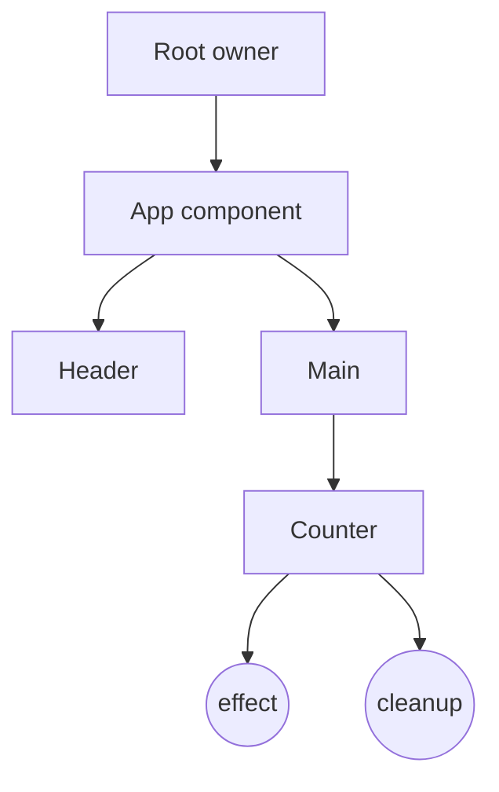

# Lifecycle and Ownership

Wybthon doesn't have lifecycle methods in the React sense. Instead, every component creates an *owner*, and effects, memos, signals, context lookups, and cleanups attach to that owner. Disposing the owner cleans them all up.

This page explains what an owner is, when it is created, and how mount/unmount/cleanup hooks fit into the model.

## The ownership tree

When a component mounts, the framework pushes a fresh owner onto the active stack. Anything created during the body — effects, memos, child components — attaches to that owner. When the parent unmounts, the framework walks the tree disposing owners depth-first.



- **Owners** form a tree mirroring the component tree.
- **Cleanups** registered via [`on_cleanup`][wybthon.on_cleanup] run when their owner is disposed.
- Disposing a parent disposes all descendants — no orphan effects.

## Lifecycle hooks

| Hook | When it runs | Typical use |
| --- | --- | --- |
| [`on_mount`][wybthon.on_mount] | Once, after the component's initial DOM is committed. | Imperative DOM access, focus, integrations. |
| [`on_cleanup`][wybthon.on_cleanup] | When the owning component (or effect) is disposed. | Cancel timers, detach listeners, abort fetches. |
| [`create_effect`][wybthon.create_effect] | Initially after mount, then on each tracked signal change. | Side effects driven by reactive state. |
| [`create_memo`][wybthon.create_memo] | Lazily on first read; recomputes when dependencies change. | Derived values you want cached. |
| [`create_resource`][wybthon.create_resource] | Triggers async work when its source changes. | Data fetching with loading/error signals. |

```python
from wybthon import (
    component, create_signal, create_effect, on_mount, on_cleanup,
)
from wybthon.html import button


@component
def Pinger():
    count, set_count = create_signal(0)

    on_mount(lambda: print("mounted"))
    on_cleanup(lambda: print("cleanup"))

    create_effect(lambda: print("count is", count()))

    return button("ping", on_click=lambda _e: set_count(count() + 1))
```

- `on_mount` fires once after the button is in the DOM.
- The effect runs once at mount (printing `0`) and again on every click.
- When `Pinger` unmounts, the cleanup fires *and* the effect is disposed automatically.

## Effects own their cleanups

Cleanups registered inside an effect belong to that effect's run, not the component:

```python
def setup_listener():
    def handler(_e):
        ...

    window.addEventListener("resize", handler)
    on_cleanup(lambda: window.removeEventListener("resize", handler))


create_effect(setup_listener)
```

Each time the effect re-runs, the previous cleanup fires *first*. This is the recommended pattern for subscriptions.

## Disposal order

Wybthon disposes owners depth-first, in reverse insertion order. The contract is:

1. Children dispose before parents.
2. Within a single owner, cleanups registered later run before earlier ones (LIFO).
3. After all cleanups, the framework removes the DOM nodes the owner introduced.

This matches what most teardown code expects.

## Reading the current owner

You rarely need this, but [`get_owner`][wybthon.get_owner] returns the active owner so you can capture it for asynchronous work:

```python
from wybthon import get_owner, run_with_owner

owner = get_owner()


async def later():
    run_with_owner(owner, do_some_work)
```

Use this when you need to schedule work outside an effect (timers, promises) and still want it tied to the component lifetime.

## Common pitfalls

- **Forgetting cleanups in effects.** If you attach a listener or start an interval, register an `on_cleanup` so re-runs and unmounts don't leak.
- **Touching DOM in the body.** Components run before the DOM exists. Use `on_mount` for any imperative DOM work.
- **Capturing stale state in async callbacks.** Read signals inside the callback, not when scheduling, to get the current value.

## Next steps

- Read [Reactivity](reactivity.md) for `create_effect` and `create_memo` semantics.
- See [Suspense and Lazy Loading](suspense-lazy.md) for async data lifecycles.
- Browse [Authoring Patterns](../guides/authoring-patterns.md) for real-world recipes.
