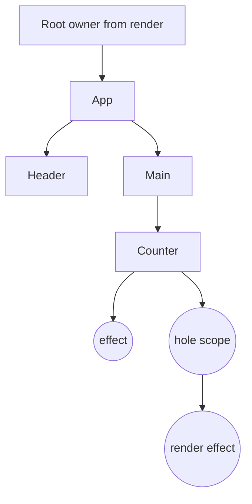

# Lifecycle and ownership

Wybthon has no lifecycle methods in the React sense. Every component
creates an *owner*, and effects, memos, cleanups, and context lookups
attach to that owner. Disposing the owner cleans them all up.

This page explains what an owner is, when it's created, when effects
and settled callbacks run, and the order in which things are torn down.

## The ownership tree

When a component mounts, the reconciler creates a fresh
[`Owner`][wybthon.Owner] for it and runs the body under that owner.
Anything created during the body (effects, memos, child components,
holes) attaches to it. When the component unmounts, the owner is
disposed and the whole subtree goes with it.


```mermaid
flowchart TD
    Root[Root owner from render] --> App[App]
    App --> Header[Header]
    App --> Main[Main]
    Main --> Counter[Counter]
    Counter --> CountEffect((effect))
    Counter --> Hole((hole scope))
    Hole --> RenderEffect((render effect))
```

- Owners form a tree mirroring the component tree, with extra nodes for holes, `For` rows, and [`create_root`][wybthon.create_root] roots.
- Cleanups registered with [`on_cleanup`][wybthon.on_cleanup] run when their owner is disposed.
- Disposing a parent disposes every descendant, so nothing is orphaned.

## Lifecycle hooks

| Hook | When it runs | Typical use |
| --- | --- | --- |
| [`on_settled`][wybthon.on_settled] | Once, after the flush that mounted the component has committed. May return a cleanup. | Imperative DOM access, focus, third-party widgets. |
| [`on_cleanup`][wybthon.on_cleanup] | When the owning scope (component, effect run, hole, or row) is disposed. | Cancel timers, detach listeners, close subscriptions. |
| [`create_effect`][wybthon.create_effect] | First on the flush after mount, then on each tracked change, always after the DOM commit. | Side effects driven by reactive state. |
| [`create_memo`][wybthon.create_memo] | At creation unless `lazy=True`; later reads bring changed inputs current. | Derived values. |
| [`create_memo`][wybthon.create_memo] with `async def` | Starts at creation unless `lazy=True`; revalidates when tracked sources change. | Data fetching with [`Loading`][wybthon.Loading]. |

```python
from wybthon import component, create_effect, create_signal, on_cleanup, on_settled
from wybthon.html import button


@component
def Pinger():
    count, set_count = create_signal(0)

    on_settled(lambda: print("mounted"))
    on_cleanup(lambda: print("unmounted"))

    create_effect(count, lambda n: print("count is", n))

    return button("ping", on_click=lambda e: set_count(lambda n: n + 1))
```

Order of events for one mount:

1. The body runs once. The button VNode is created; the effect and callbacks are registered but nothing has run yet.
2. The tree mounts and the flush commits the DOM.
3. The effect phase runs the effect: `count is 0`.
4. The settled queue runs: `mounted`.
5. Each click stages a write; the handler returns, the graph flushes, and the effect prints the new count.
6. On unmount the owner is disposed: the effect is torn down and `unmounted` prints.

## Effects own their cleanups

A cleanup registered inside an effect belongs to that *run* of the
effect, not to the component. Each re-run fires the previous cleanup
first:

```python
from wybthon import create_effect, create_tracked_effect, on_cleanup


def track_resize():
    handler = make_handler(size())
    window.addEventListener("resize", handler)
    on_cleanup(lambda: window.removeEventListener("resize", handler))


create_tracked_effect(track_resize)
```

The split form expresses the same thing without `on_cleanup`: return the
cleanup from `apply`, and it runs before the next `apply` and on
disposal:

```python
def attach(current_size):
    handler = make_handler(current_size)
    window.addEventListener("resize", handler)
    return lambda: window.removeEventListener("resize", handler)


create_effect(size, attach)
```

## `on_settled` and refs

Refs are assigned during mount, so `ref.current` is `None` while the
body runs. Read refs in `on_settled` or in an effect:

```python
from wybthon import Ref, component, on_settled
from wybthon.html import div, input_


@component
def AutoFocus():
    ref = Ref()
    on_settled(lambda: ref.current.element.focus())
    return div(input_(type="text", ref=ref))
```

`on_settled` may return a cleanup, which runs when the component
unmounts. That makes it the natural home for one-shot integrations that
need teardown:

```python
def start():
    chart = ChartLib(ref.current.element)
    return chart.destroy


on_settled(start)
```

## Disposal order

Disposal is depth-first:

1. Children are disposed before their parent.
2. Within one owner, cleanups run in LIFO order (the last registered runs first).
3. A component's DOM nodes are removed in the same batch, and the freed node ids are released to the kernel.

When a computation re-runs, it disposes its children and runs its
cleanups *before* re-executing, so effects created conditionally in a
previous run never leak into the next.

A hole is a scope of its own. Components mounted inside a hole survive
the hole's re-evaluations as long as the reconciler can patch them in
place (same tag, same key); they're disposed when the hole drops them
or when the hole itself unmounts.

## Roots

[`render`][wybthon.render] returns a [`Root`][wybthon.Root]. Calling
`root.dispose()` unmounts the tree, disposes every scope beneath it,
and unregisters the container as an event delegation root. For reactive
work that outlives any component, use `create_root`, which hands you a
`dispose` callable of its own.

## Reading the current owner

You rarely need this, but [`get_owner`][wybthon.get_owner] returns the
active owner so you can capture it before an `await` and restore it
with [`run_with_owner`][wybthon.run_with_owner]:

```python
from wybthon import create_effect, get_owner, run_with_owner


async def later():
    owner = get_owner()
    await wait_for_something()
    run_with_owner(owner, lambda: create_effect(count, lambda n: print(n)))
```

Async memos and async effects do this for you: every resume after an
`await` runs as the same computation, under the same owner.

## Common pitfalls

- **Forgetting cleanups.** If you attach a listener or start an interval, return a cleanup from `apply` or register one with `on_cleanup`, so re-runs and unmounts don't leak.
- **Touching the DOM in the body.** The body runs before the DOM exists. Use `on_settled` or an effect.
- **Reading props at the top level.** The read is frozen at mount and dev mode warns. Read inside a hole, memo, or effect, or use `.peek()` deliberately.
- **Expecting effects to run at creation.** The first run is deferred to the next flush. In tests, call [`flush`][wybthon.flush] after `render` before asserting on effect output.

## Next steps

- Read [Reactivity](reactivity.md) for flush phases and scheduling.
- See [Async and loading](async-loading.md) for async data lifecycles.
- Browse [Authoring patterns](../guides/authoring-patterns.md) for real-world recipes.

## Held applications and async cleanup

A split effect's apply scope survives while its replacement is held by an async transition. Returned cleanup and `on_cleanup` registered during apply run before the next visible apply. Compute-stage cleanup still follows recomputation.

Nested `create_root` calls belong to the current owner by default. `detached=True` opts into an explicitly managed lifetime. Async computations and handlers are canceled when their owning scope is disposed; their asynchronous `finally` blocks can finish cleanup. See [Runtime contracts](runtime-contracts.md).
