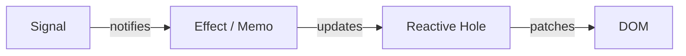

# Mental Model

A short tour of how Wybthon thinks. Read this once and the rest of the docs will click into place.

## The four big ideas

1. **Run-once components.** Function components execute exactly once at mount. They build a virtual DOM tree and return it. The body never re-runs because a prop or signal changed.
2. **Fine-grained reactivity.** Updates flow through small, isolated subscriptions called *reactive holes*. Only the DOM nodes that depend on a changed signal are patched.
3. **Props are accessors.** Every prop a component receives is a zero-argument callable. Calling it inside an effect or as a child creates a subscription; reading it inside the body without an effect captures only the current value.
4. **Ownership tree, not parent re-renders.** Effects, memos, cleanups, and context all attach to the *owner* established when a component is mounted. Disposing the owner cleans everything up — there is no "render cycle" to coordinate.

## The data flow



- A [`signal`][wybthon.create_signal] is a getter/setter pair. Reading inside a tracking scope subscribes; writing notifies subscribers.
- An [`effect`][wybthon.create_effect] re-runs when its tracked signals change.
- A [`memo`][wybthon.create_memo] is a derived signal — cached and lazy.
- A *reactive hole* is the framework's internal effect that wires a signal to a single DOM node (text, attribute, child slot, or component prop).
- The [`reconciler`][wybthon.reconciler] turns the resulting patches into batched DOM mutations.

## What this looks like in practice

```python
from wybthon import component, create_signal, dynamic
from wybthon.html import button, div, p


@component
def Counter():
    count, set_count = create_signal(0)

    return div(
        p("Count: ", dynamic(lambda: count())),
        button("+1", on_click=lambda _e: set_count(count() + 1)),
    )
```

What happens here:

- `Counter` runs **once**. The `div`, `p`, and `button` virtual nodes are created exactly one time.
- `dynamic(lambda: count())` creates a reactive hole around the text inside `<p>`. Only that text node patches when `count` changes.
- The `on_click` handler is delegated through [`events`][wybthon.events]; clicking calls `set_count`, which notifies the hole.

## How props become reactive

```python
@component
def Greeting(name):
    return p("Hello, ", name, "!")
```

- `name` arrives as a callable. Passing it into `p(...)` creates a reactive hole — when the parent updates `name`, only that text node changes.
- Reading `name()` inside the body would freeze the value at mount. Read it inside an effect, memo, or callable child to stay reactive.

See [Components][wybthon.component] for the full prop story.

## Where it differs from React

- No virtual DOM diff cycles per-component. The tree is built once; updates target individual holes.
- No hooks rules. State and effects are created with normal Python functions and live for the lifetime of the owning component.
- Props don't need to be memoized for performance. Identity changes don't trigger re-renders.

If you're coming from React, read [Migrating from React](../guides/migrating-from-react.md) next.

## Where it matches Solid

Wybthon is intentionally close to SolidJS: the same primitives, the same fine-grained model, the same "components run once" rule. The biggest differences are the language (Python vs JS), templates (Pythonic builders vs JSX), and a few API names. See [Migrating from Solid](../guides/migrating-from-solid.md).

## Next steps

- Read [Reactivity](reactivity.md) for the primitive reference.
- Read [Lifecycle and Ownership](lifecycle.md) to understand when effects and cleanups run.
- Skim [Primitives](primitives.md#reactive-holes) for the formal definition of a reactive hole.
