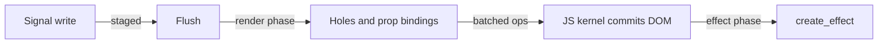

# Mental model

Wybthon is SolidJS for Python: the same fine-grained reactive model, a Pythonic API, and a renderer built for Pyodide. Read this page once and the rest of the docs will click into place.

## The five big ideas

1. **Signals are the source of truth.** A signal is a `(getter, setter)` pair. Reading it inside a tracking scope subscribes that scope; writing it stages a change that becomes visible at the next flush. Every write batches; there's no `batch()`.
2. **Derivations are lazy and glitch-free.** A memo recomputes only when it's read after a source changed, and it notifies its observers only when its value actually changed. An `async def` memo is the data-fetching primitive.
3. **Components run once.** The body executes a single time when the component mounts and returns a tree. Every parameter is a `Prop[T]` accessor. Anything reactive lives in a hole, a memo, or an effect, never in the body itself.
4. **Holes, not re-renders.** A reactive expression placed in the tree becomes a *hole*: its own render effect that re-renders only its subtree. A signal change re-runs the holes that read it, never whole components.
5. **Ownership, not lifecycle methods.** Effects, memos, cleanups, and context attach to the *owner* that was active when they were created. Disposing the owner tears everything down depth-first.

## The data flow


```mermaid
flowchart LR
    A[Signal write] -->|staged| B[Flush]
    B -->|render phase| C[Holes and prop bindings]
    C -->|batched ops| D[JS kernel commits DOM]
    D -->|effect phase| E[create_effect]
```

- A [`create_signal`][wybthon.create_signal] write is staged. The graph flushes on the next microtask, at the end of every event handler, or when you call [`flush`][wybthon.flush] yourself (in tests).
- In the render phase, every dirty hole and reactive prop binding re-runs and emits DOM operations into a buffer.
- The buffer is handed to the JavaScript kernel in one bridge crossing.
- In the effect phase, [`create_effect`][wybthon.create_effect] computations run and observe the committed DOM.

## What this looks like in practice

```python
from wybthon import Prop, component, create_signal, prop
from wybthon.html import button, div, p


@component
def Counter(step: Prop[int] = prop(1)):
    count, set_count = create_signal(0)

    return div(
        p("Count: ", count),
        button("+", on_click=lambda e: set_count(lambda n: n + step())),
    )
```

What happens here:

- `Counter` runs **once**. The `div`, `p`, and `button` VNodes are created exactly one time.
- `count` is an accessor placed as a child, so it becomes a hole. Only that text node patches when the count changes.
- `step` is a `Prop[int]`. The parent may pass `step=5` or `step=my_signal`; the child reads `step()` either way.
- The click handler stages a functional update. The handler returns, the graph flushes, and the DOM op commits before the browser paints.

## How props become reactive

```python
from wybthon import Prop, component
from wybthon.html import p


@component
def Greeting(name: Prop[str]):
    return p("Hello, ", name, "!")
```

- `name` is an accessor. Placing it in `p(...)` creates a hole, so when the parent's value changes only that text node updates.
- Calling `name()` at the top level of the body would freeze the value at mount, and dev mode warns about it. Read props inside holes, memos, and effects, or use `name.peek()` when a one-time read is what you want.

See [Components](components.md) for the full prop story.

## Why a virtual DOM at all?

SolidJS compiles JSX into direct DOM instructions. Python has no JSX compiler, and in Pyodide every DOM call crosses the Python-to-JS bridge, which dominates rendering cost. Wybthon therefore keeps a small VDOM as an implementation detail: the reconciler diffs hole subtrees and emits compact ops that the JS kernel applies in one crossing per flush. Static subtrees are serialized once as HTML templates and cloned natively. The reactive model is Solid's; the VDOM is the batching layer that makes it fast under Pyodide. See [Virtual DOM](vdom.md).

## Where it differs from React

- No per-component re-render. The tree is built once; updates target individual holes.
- No hooks rules. State and effects are created with ordinary Python calls and live for the lifetime of the owning scope.
- Props never need memoizing. A new object identity doesn't re-render anything; only reads inside holes react.
- Data fetching is a memo, not a hook. Read an async memo like any other accessor; the nearest [`Loading`][wybthon.Loading] boundary handles the not-ready state.

If you're coming from React, read [Migrating from React](../guides/migrating-from-react.md) next.

## Where it matches Solid

Wybthon follows SolidJS 2.0 closely: signals, memos, and effects with the same semantics; staged writes with no `batch()`; async as part of the graph; `Loading`, `Reveal`, and `Errored` boundaries; draft-first stores; actions and optimistic state. The differences are the language, the tree builders (Python call syntax instead of JSX), and a handful of names. See [Migrating from Solid](../guides/migrating-from-solid.md).

## Next steps

- Read [Reactivity](reactivity.md) for signals, memos, effects, and flush timing.
- Read [Primitives](primitives.md) for the full primitive reference.
- Read [Lifecycle and ownership](lifecycle.md) to understand when effects and cleanups run.
