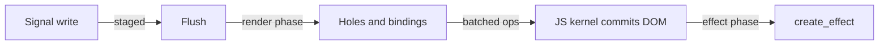

# Mental model

Wybthon is SolidJS for Python: the same fine-grained reactive model, a Pythonic API, and a renderer built for Pyodide. Read this page once and the rest of the docs will click into place.

## The five big ideas

1. **Signals are the source of truth.** A signal is a `(getter, setter)` pair. Reading it inside a tracking scope subscribes that scope; writing it stages a change that becomes visible at the next flush. Every write batches; there's no `batch()`.
2. **Derivations are lazy and glitch-free.** A memo recomputes only when it's read after a source changed, and it notifies its observers only when its value actually changed. An `async def` memo is the data-fetching primitive.
3. **Components run once.** The body executes a single time when the component mounts and returns its markup. Inputs are declared on a typed `Props` class, and every `Prop[T]` field reads as an accessor. Anything reactive lives in a hole, a memo, or an effect, never in the body itself.
4. **Markup compiles once; holes update.** A template literal (`html(t"...")`) is compiled the first time it runs into a native `<template>` plus a list of slots, and every instance is a clone with its slots filled. A reactive expression placed in a slot becomes a *hole* or a binding: its own render effect that updates only its text, attribute, or subtree. A signal change re-runs the holes that read it, never whole components.
5. **Ownership, not lifecycle methods.** Effects, memos, cleanups, and context attach to the *owner* that was active when they were created. Disposing the owner tears everything down depth-first.

## The data flow


```mermaid
flowchart LR
    A[Signal write] -->|staged| B[Flush]
    B -->|render phase| C[Holes and bindings]
    C -->|batched ops| D[JS kernel commits DOM]
    D -->|effect phase| E[create_effect]
```

- A [`create_signal`][wybthon.create_signal] write is staged. The graph flushes on the next microtask, at the end of every event handler, or when you call [`flush`][wybthon.flush] yourself (in tests).
- In the render phase, every dirty hole and reactive binding re-runs and emits DOM operations into a buffer. Nothing static is revisited: a template's static markup was cloned once, at mount.
- The buffer is handed to the JavaScript kernel in one bridge crossing.
- In the effect phase, [`create_effect`][wybthon.create_effect] computations run and observe the committed DOM.

## What this looks like in practice

```python
from wybthon import Prop, Props, component, create_signal, html, prop


class CounterProps(Props):
    step: Prop[int] = prop(default=1)


@component
def Counter(props: CounterProps):
    count, set_count = create_signal(0)

    def increment():
        set_count(lambda n: n + props.step())

    return html(t"""
      <div>
        <p>Count: {count}</p>
        <button onclick={increment}>+</button>
      </div>
    """)
```

Template strings (`t"..."`) are [PEP 750](https://peps.python.org/pep-0750/) syntax, so Wybthon requires Python 3.14.

What happens here:

- `Counter` runs **once**. The first time any `Counter` mounts, Wybthon compiles the template literal; every mount, including that first one, clones the compiled `<template>` with one kernel command.
- `{count}` interpolates an accessor, so that slot becomes one reactive binding. Only that text node patches when the count changes.
- `step` is a `Prop[int]` field. The parent may pass `step=5` or `step=my_signal`; the child reads `props.step()` either way.
- `onclick={increment}` binds a delegated handler. It takes no arguments because it doesn't need the event. It stages a functional update, the handler returns, the graph flushes, and the DOM op commits before the browser paints.

## How props become reactive

```python
from wybthon import Prop, Props, component, html


class GreetingProps(Props):
    name: Prop[str]


@component
def Greeting(props: GreetingProps):
    return html(t"<p>Hello, {props.name}!</p>")
```

- `props.name` is an accessor. Placing it in the template creates a binding, so when the parent passes a signal only that text node updates.
- Calling `props.name()` at the top level of the body would freeze the value at mount, and dev mode warns about it. Read props inside holes, memos, and effects, or use `props.name.peek()` when a one-time read is what you want.
- Fields that aren't `Prop[T]`, such as callbacks, are plain data: the read returns exactly what the parent passed.
- A prop costs only what it needs. When the parent passes a constant (`Greeting(name="Ada")`) to a component that can never receive new props, the read subscribes to nothing.

See [Components](components.md) for the full prop story.

## Why a virtual DOM at all?

SolidJS compiles JSX ahead of time into a static template plus the expressions that change. Wybthon gets the same split from the language: a t-string literal's static strings are the same object on every call, so Wybthon compiles each literal once into a native `<template>`, a generated mount function, and a plan of its slots. Mounting an instance is one clone command, with no VNode tree for its static parts.

In Pyodide every DOM call crosses the Python-to-JavaScript bridge, which dominates rendering cost. So Wybthon keeps a small VDOM as an implementation detail: holes and bindings emit compact operations into a buffer that the JavaScript kernel applies in one crossing per flush. When a hole re-renders, the reconciler diffs only that hole's subtree, and a template from the same literal is patched slot by slot. The [element helpers](../api/elements.md) (`div(...)`, `p(...)`) are the programmatic path for markup built by code; they build VNodes, and each repeated helper subtree is compiled into a shape that mounts with the same kind of clone command. The reactive model is Solid's; the VDOM is the batching layer that makes it fast under Pyodide. See [Templates](templates.md) and [Virtual DOM](vdom.md).

## Where it differs from React

- No per-component re-render. The tree is built once; updates target individual holes.
- No hooks rules. State and effects are created with ordinary Python calls and live for the lifetime of the owning scope.
- Props never need memoizing. A new object identity doesn't re-render anything; only reads inside holes react.
- Data fetching is a memo, not a hook. Read an async memo like any other accessor; the nearest [`Loading`][wybthon.Loading] boundary handles the not-ready state.

If you're coming from React, read [Migrating from React](../guides/migrating-from-react.md) next.

## Where it matches Solid

Wybthon follows SolidJS 2.0 closely: signals, memos, and effects with the same semantics; staged writes with no `batch()`; async as part of the graph; `Loading`, `Reveal`, and `Errored` boundaries; draft-first stores; actions and optimistic state. The differences are the language, the markup (t-string templates in place of JSX, and element helpers in place of `h`), typed `Props` classes in place of TypeScript prop interfaces, and a handful of names. See [Migrating from Solid](../guides/migrating-from-solid.md).

## Next steps

- Read [Templates](templates.md) for the markup syntax.
- Read [Reactivity](reactivity.md) for signals, memos, effects, and flush timing.
- Read [Primitives](primitives.md) for the full primitive reference.
- Read [Lifecycle and ownership](lifecycle.md) to understand when effects and cleanups run.
