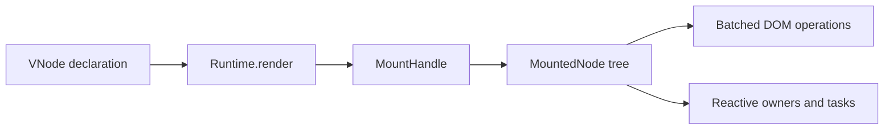

# Runtime and Mounts

Wybthon separates what an application *declares* from what the renderer
*owns*.



A `VNode` contains only a tag, props, children, and an optional key. It has
no DOM reference, effect, owner, or component instance. This means the same
VNode object can appear twice in one tree or mount into two containers
without sharing mutable renderer state.

The internal `MountedNode` tree holds occurrence-specific state: DOM IDs,
mounted children, component contexts, render effects, refs, and owned
regions. Application code doesn't manipulate `MountedNode` directly.

## Mount handles

```python
from wybthon import create_runtime, div

runtime = create_runtime()
handle = runtime.render(div("Hello"), "#root")

handle.update(div("Updated"))
handle.dispose()
```

`MountHandle.dispose()` is idempotent. It removes the mounted DOM, disposes
every owner, cancels resource and transition tasks owned by the tree, and
forgets the container in its runtime. A handle is also a context manager.

The top-level `render(...)` function uses one default runtime and returns the
same kind of handle. Calling it again for the same container patches the
existing mount.

## Owned regions

Fragments, reactive holes, flow-control branches, providers, portals, and
Suspense boundaries are explicit mounted regions. Each region knows its DOM
range and owner. That gives cleanup one reliable path and lets Suspense move
primary content to a detached fragment without destroying its state.

## Diagnostics

`runtime.stats()` returns counts for mounts, mounted nodes, owners, and
async tasks. A disposed runtime should report zeros for all four values.
These counters are useful for repeated mount and unmount tests and for
detecting leaks in benchmarks.

## Why Wybthon still uses a VDOM

The VDOM is the declaration and reconciliation layer, while the runtime is
the ownership layer. Pyodide DOM calls cross the Python-to-JavaScript bridge,
so Wybthon batches mutations through the VDOM and kernel. Static host trees
also compile to reusable mount blueprints and native `<template>` clones.
This preserves Solid's API and fine-grained mental model while using an
implementation suited to Python in the browser.
